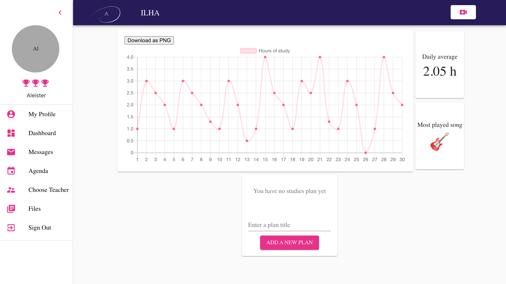

# Ilha.io


<br>

<p align="center">
  <a href="https://loving-keller-6b53a6.netlify.app/">
    
  </a>

  <br>

  <p align="center">
    ILHA is an online music-learning platform created with love by passionate
    musicians to empower musicians from all cultures.
    <br />
  </p>
</p>
<br/>
<br/>

<details open="open">
  <summary>Table of Contents</summary>
  <ol>
    <li>
      <a href="#about-the-project">About The Project</a>
      <ul>
        <li><a href="#built-with">Built With</a></li>
      </ul>
    </li>
    <li>
      <a href="#getting-started">Getting Started</a>
      <ul>
        <li><a href="#prerequisites">Prerequisites</a></li>
        <li><a href="#installation">Installation</a></li>
      </ul>
    </li>
    <li><a href="#contact">Contact</a></li>
    <li><a href="#acknowledgements">Acknowledgements</a></li>
  </ol>
</details>
<br>

## About The Project

<br/><br/>

[](https://loving-keller-6b53a6.netlify.app/)

This product is the outcome of two months collaboration between five dedicated Web Development students utilizing all they have learned throughout a 5-month course intensive at the Wild Code School. Ilha.io, the client, is an established music-learning platform created exclusively for musicians by musicians. The client has requested a number of features to be implemented into the current version of the Live website.

Implementations:
- Registration Form to create an account.
- Multimedia Dashboard containing the user's profile and access to the website's essentials.
- Realtime Analytics Graph charting the amount of time spent learning for ease of tracking personal progress. 
- Studies Plan to allow the student to create personal tasks and schedules.
- Live Video Streaming Environment/classrom for teachers-student interaction.
- Recorded & Downloading Videos of a live streamed study session.

Our team decided to re-create the majority of the official website in order to incorporate all additional features without affecting the premier product in conjunction with gaining insight into the full function of it’s technicality. As a result, specific frameworks were substituted by others, such as employing Redux in lieu of Context. 


### Built With
* [](https://reactjs.org)
* [](https://material-ui.com/)
* [](https://material-ui.com/)
* 
* 
* 
* 


<br/>

## Getting Started

### Prerequisites

Node.JS required to install all dependencies.
* npm
  ```sh
  npm install npm@latest -g
  ```

### Installation

1. Clone the repo
   ```sh
   git clone https://github.com/aCastilloNL/IlhaDevelopment.git
   ```
2. Install NPM packages
   ```sh
   npm install
   ```
3. Create your vars in the .env files (use .env.example inside api and client folders).
   ```JS
   const SECRET_TOKE = 'ENTER-A-SECRET-WORD';

<br/>

   <!-- CONTACT -->
## Contact

Alfred Castillo - [@aCastilloNL](https://github.com/aCastilloNL) 

Victoria Kulinkovich - [@KulinkovichVA](https://github.com/KulinkovichVA)

Fabien Lallement - [@Befa222](https://github.com/Befa222) 

Aya Berdyeva - [@AyaDesigner](https://github.com/AyaDesigner)

Roxana Florea - [@roxana-florea](https://github.com/roxana-florea) 

Project Link: [Ilha](https://loving-keller-6b53a6.netlify.app/Dashboard)

<br/>

<!-- ACKNOWLEDGEMENTS -->
## Acknowledgements
* [Img Shields](https://shields.io)
* [Font Awesome](https://fontawesome.com)
